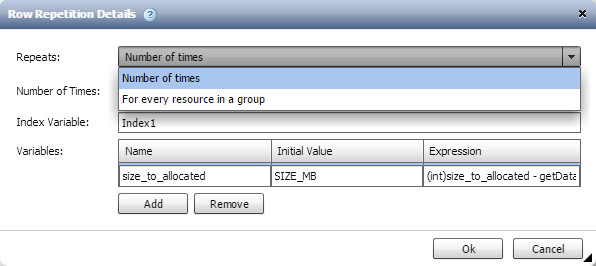
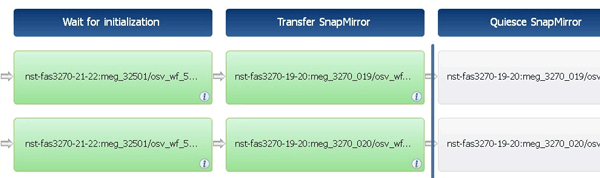

= How repeat row works
:icons: font
:imagesdir: ../media/

A workflow contains commands and command details arranged in rows. You can specify the commands in a row to be repeated for a fixed number of iterations or dynamic number of iterations based on the results of a search criteria.

The command details in a row can be specified to repeat a certain number of times or when the workflow is designed. The workflow can also be designed such that the number of times the row must repeat can be specified when the workflow is executed or scheduled for an execution. You can specify a search criteria for an object and the commands in a row can be set to repeat as many times as the objects are returned by the search criteria. Rows can also be set to repeat when certain conditions are met.

== Row repetition variables

You can specify variables in the variable list that can be manipulated during the row iterations. For the variables, you can specify a name, a value with which the variables are initialized, and an MVFLEX Expression Language (MVEL) expression that is evaluated after every iteration of the row repetition.

The following illustration shows the repeat row options and an example of a row repetition variable:

== Row repetition with approval points

When you have specified iterations of repeat rows for commands and included approval points, all the iterations of the commands before an approval point are executed. After you approve the approval point, the execution of all iterations of the successive commands continues until the next approval point.

The following illustration shows how the iterations of repeat rows are executed when an approval point is included in a workflow:

== Repeat row examples in predefined workflows

You can open the following predefined workflows in the Designer to understand how repeat rows are used:

* Create a Clustered Data ONTAP NFS Volume
* Create VMware NFS Datastore on Clustered Data ONTAP Storage
* Establish Cluster Peering
* Remove a Clustered Data ONTAP Volume
