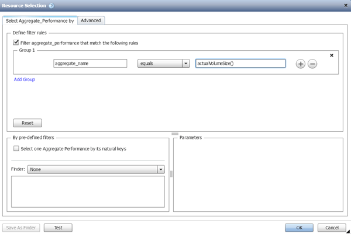

= How resource selection works
:icons: font
:imagesdir: ../media/

[.lead]
OnCommand Workflow Automation (WFA) uses search algorithms to select storage resources for workflow execution. You should understand how resource selection works in order to design workflows efficiently.

WFA selects dictionary entry resources--such as vFiler units, aggregates, and virtual machines--using search algorithms. The selected resources are then used for executing the workflow. The WFA search algorithms are part of the WFA building blocks, and include finders and filters. To locate and select the required resources, the search algorithms search through the data that is cached from different repositories, such as OnCommand Unified Manager, VMware vCenter Server, and a database. By default, a filter is available for every dictionary entry for searching a resource based on its natural keys.

You should define the resource selection criteria for each command in your workflow. In addition, you can use a finder to define the resource selection criteria in each row of your workflow. For example, when you are creating a volume that requires a specific amount of storage space, you can use the "`Find aggregate by available capacity`" finder in the "`Create Volume`" command, which selects an aggregate with a specific amount of available space and creates the volume on it.

You can define a set of filter rules for dictionary entry resources, such as vFiler units, aggregates, and virtual machines. Filter rules can contain one or more groups of rules. A rule consists of a dictionary entry attribute, an operator, and a value. The attribute can also include attributes of its references. For example, you can specify a rule for aggregates as follows: List all aggregates that have names starting with the string "`aggr`" and have more than 5 GB of available space. The first rule in the group is the attribute "`name`", with the operator "`starts-with`", and the value "`aggr`". The second rule for the same group is the attribute "`available_size_mb`", with the operator "`>`", and the value "`5000`". You can define a set of filter rules along with public filters. The Define filter rules option is disabled if you have selected a finder. The Save as Finder option is disabled if you have selected the Define filter rules check box.

In addition to the filters and finders, you can use a search or define command to search for available resources. The search or define command is the preferred option over the No-op commands. The search and define command can be used to define resources of both the certified dictionary entry type and the custom dictionary entry type. The search or define command searches for resources but does not perform any action on the resource. However, when a finder is used to search for resources, it is used in the context of a command, and the actions defined by the command are executed on the resources. The resources returned by a search or define command are used as variables for the other commands in the workflow.

The following illustration shows that a filter is used for resource selection:

== Resource selection examples in predefined workflows

You can open the command details of the following predefined workflows in the Designer to understand how resource selection options are used:

* Create a Clustered Data ONTAP NFS Volume
* Establish Cluster Peering
* Remove a Clustered Data ONTAP Volume
