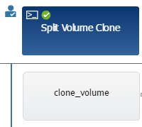

= What approval points are
:icons: font
:imagesdir: ../media/

[.lead]
Approval points are check points used in a workflow to pause the workflow execution and resume it based on a user approval.

The blue vertical bar shown in the following illustration is an approval point:

You can use approval points for incremental execution of a workflow, where sections of the workflow should be executed only after a certain condition is met. For example, when the next section has to be approved or when successful execution of the first section is validated. Approval points do not handle any process between pausing and resuming of a workflow. Email and SNMP notifications are sent, as specified in the WFA configuration, and the storage operator can be asked to perform certain actions upon receiving the workflow pause notification. For example, the storage operator can send planning details to admin, approver, or operator for approval and resume the workflow when the approval is received.

Approvals might not be required at all times. In some scenarios, the approval might be required only if a particular condition is met and the conditions can be configured when an approval point is added. For example, consider a workflow that is designed to increase the size of a volume. You can add an approval point at the beginning of the workflow for the storage operator to obtain approval from the managers when the increase in the volume size results in an 85% usage of the space in the aggregate that contains the volume. During the workflow execution and on selecting a volume that results in this condition, the execution is stopped until it is approved.

The condition that is set up for the approval point can have one of the following options:

* Without any condition
* When the variable you have specified is found
* When the variable you have specified is not found
* When the expression you have specified evaluates to true

There is no limitation on the number of approval points in a workflow. You can insert approval points before commands in a workflow and set the commands after the approval point to wait for approval before execution. Approval points provide information, such as time of change, user, and comments, allowing you to see when and why the workflow execution was paused or resumed. The approval point comments can include MVEL expressions.

== Approval point examples in predefined workflows

You can open the following predefined workflows in the Designer to understand how approval points are used:

* Remove a Clustered Data ONTAP Volume
* Controller and shelf upgrade of an HA pair
* Migrate Volumes
