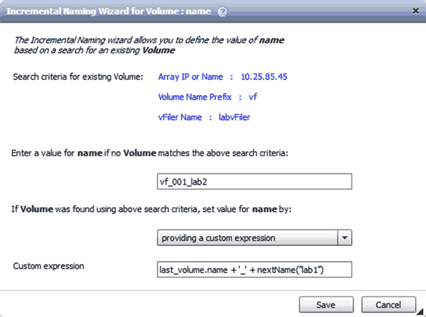

= What incremental naming is
:icons: font
:imagesdir: ../media/

[.lead]
Incremental naming is an algorithm that enables you to name the attributes in a workflow based on the search results for a parameter. You can name the attributes based on an incremental value or a custom expression. The incremental naming functionality helps you implement a naming convention based on your requirement.

You can use the incremental naming functionality when designing workflows to dynamically name the objects created by the workflow. The functionality enables you to specify a search criteria for an object using the resource selection feature and the value returned by the search criteria is used for the object's attribute. In addition, you can specify a value for the attribute if no object was found with the specified search criteria.

You can use one of the following options for naming the attributes:

* Providing an increment value and suffix
+
You can provide a value that should be used along with the value of the object found by the search criteria and increment with the number you specify. For example, if you want to create volumes with the naming convention of filer name_unique number_environment, you can use a finder to find the last volume by its name prefix and increment the unique number by 1, as well as add the suffix name to the volume name. If the last volume name prefix found was vf_023_prod and you are creating three volumes, the names for the volumes created are vf_024_prod, vf_025_prod, and vf_026_prod.

* Providing a custom expression
+
You can provide a value that should be used along with the value of the object found by the search criteria and add additional values based on the expression you enter. For example, if you want to create a volume with the naming convention of last volume name_environment name padded with 1, you can enter the expression `last_volume.name + '_' + nextName("lab1")`. If the last volume name found was vf_023, the name for the volume created is vf_023_lab2.

The following illustration shows how a custom expression can be provided to specify a naming convention:

