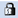

= Functions window
:icons: font
:imagesdir: ../media/

[.lead]
The Functions window displays the available OnCommand Workflow Automation (WFA) functions and enables you to manage these functions.

Functions are complementary tools for performing significant or black-boxed operations that are required for planning workflow executions. Functions are processed during the planning phase. Functions can be used to complete repetitive and complex tasks, such as defining a complex naming convention. Functions run in their own sandbox and might use other functions during execution. Functions are written in MVFLEX Expression Language (MVEL).

== Functions table

The Functions table lists the available WFA functions. Each entry is identified as one of the following:

* No icon - content created by users
* image:../media/ps_certified_icon_wfa.gif[] - content developed by Professional Services (PS), which is available only on custom installations made by PS
* image:../media/community_certification.gif[] - packs developed by users
*  - content created by users that is locked
* image:../media/netapp_certified.gif[] - NetApp-certified content

You can customize the table display by using the filtering and sorting features available for each column, as well as by rearranging the column order.

* image:../media/filter_icon_wfa.gif[Filter icon] enables or disables filtering for the entire table. A red "x" appears over the icon if filtering is disabled.
* Double-clicking image:../media/filter_icon_wfa.gif[Filter icon] clears and resets the filtering selections.
* image:../media/wfa_filter_icon.gif[Filter icon] on each column header enables you to filter based on the content of the columns. Clicking image:../media/wfa_filter_icon.gif[Filter icon] in a column allows you to filter on a specific item from the drop-down list or on all available items.
* Clicking the column header toggles between ascending and descending order of sorting. You can identify the applied sort order by the sort arrows (image:../media/wfa_sortarrow_up_icon.gif[Sort up icon] for ascending and image:../media/wfa_sortarrow_down_icon.gif[Sort down icon] for descending).
* To rearrange the location of columns, you can drag and drop columns to place them in any required order. However, you cannot hide or delete any of these columns.
* Clicking the *Search* filter text box allows you to search for specific content. In addition, you can search using supported operators for the applicable column type, Alphabetic or Numeric.

The Functions table contains the following columns:

* *Certification*
+
Indicates whether the function is user-created (no icon, empty cell), PS (image:../media/ps_certified_icon_wfa.gif[]), community (image:../media/community_certification.gif[]), user-locked (), or NetApp-certified (image:../media/netapp_certified.gif[]).

* *Name*
+
Displays the name of the function.

* *Entity Version*
+
Displays the version number of the object in _major.minor.revision_ format--for example, 1.0.0.

* *Description*
+
Displays the description of the functions.

* *Last Updated On*
+
Displays the date and time when the function was last updated.

* *Updated By*
+
Displays the user who updated the function.

* *Locked By*
+
Displays the user who locked the function.

== Toolbar

The toolbar is located above the column header. You can use the icons in the toolbar to perform various actions. These actions can also be accessed from the right-click menu in the window.

* *image:../media/new_wfa_icon.gif[New icon] (New)*
+
Opens the New Function window, which enables you to create a new function.

* *image:../media/edit_wfa_icon.gif[Edit icon] (Edit)*
+
Opens the Function <EntryName> window for the selected function, which enables you to edit the function.

* *image:../media/clone_wfa_icon.gif[Clone icon] (Clone)*
+
Opens the New Function <EntryName>_copy window, which enables you to create a copy of the selected function.

* *image:../media/lock_wfa_icon.gif[Lock icon] (Lock)*
+
Opens the Lock the Function confirmation dialog box, which enables you to lock the selected function. This option is enabled only for the functions that you have created.

* *image:../media/unlock_wfa_icon.gif[Unlock icon] (Unlock)*
+
Opens the Unlock the Function confirmation dialog box, which enables you to unlock the selected function.
+
This option is enabled only for the functions that you have locked. Administrators can unlock functions that were locked by other users.

* *image:../media/delete_wfa_icon.gif[Delete icon] (Delete)*
+
Opens the Delete Function confirmation dialog box, which enables you to delete the selected user-created function.
+
NOTE: You cannot delete a WFA or PS function.

* *image:../media/export_wfa_icon.gif[Export icon] (Export)*
+
Enables you to export the selected user-created function.
+
NOTE: You cannot export a WFA or PS function.

* *image:../media/test_wfa_icon.gif[test icon] (Test)*
+
Opens the Test dialog box, which enables you to test the selected function.

* *image:../media/add_to_pack.png[add to pack icon] (Add To Pack)*
+
Opens the Add To Pack Functions dialog box, which enables you to add the function and its dependable entities to a pack, which is editable.
+
NOTE: The Add To Pack feature is enabled only for functions for which the certification is set to None.

* *image:../media/remove_from_pack.png[remove from pack icon] (Remove From Pack)*
+
Opens the Remove From Pack Functions dialog box for the selected function, which enables you to delete or remove the function from the pack.
+
NOTE: The Remove From Pack feature is enabled only for functions for which the certification is set to None.
