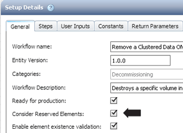

= How reservation works
:icons: font
:imagesdir: ../media/

[.lead]
OnCommand Workflow Automation resource reservation capability reserves the required resources to ensure that the resources are available for successful execution of workflows.

WFA commands can reserve the required resources and remove the reservation after the resource is available in the WFA cache database, typically after a cache acquisition. The reservation capability ensures that the reserved resources are available for the workflow until the reservation expiration period that you have configured in the WFA configuration settings.

You can use the reservation capability to exclude resources reserved by other workflows during resource selection. For example, if a workflow that has reserved 100 GB of space on an aggregate is scheduled for execution after a week, and you are executing another workflow that uses the *Create Volume* command, the workflow that is executing does not consume the space reserved by the scheduled workflow to create a new volume. In addition, the reservation capability enables workflows to be executed in parallel.

When previewing a workflow for execution, the WFA planner considers all the reserved objects, including the existing objects in the cache database. If you have enabled reservation, the effects of the scheduled workflows and the workflows that are executing in parallel, and the existence of storage elements are considered when planning the workflow.

The arrow in the following illustration shows that reservation is enabled for the workflow:

== Reservation examples in predefined workflows

You can open the following predefined workflows in the Designer to understand how reservation is used:

* Clone Environment
* Create a Clustered Data ONTAP Volume
* Establish Cluster Peering
* Remove a Clustered Data ONTAP Volume
