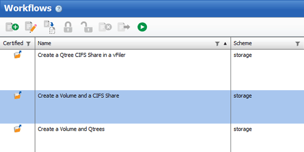
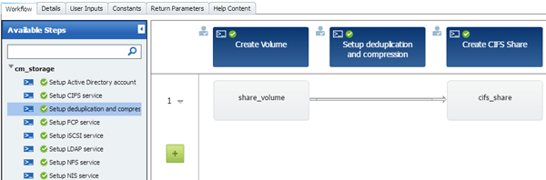
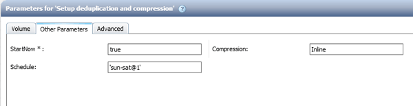

= Customize the Create a Volume and a CIFS Share workflow
:icons: font
:imagesdir: ../media/

[.lead]
You can customize your workflows based on your requirements. For example, you can modify the predefined _Create a Volume and a CIFS Share_ workflow to include deduplication and compression.

*About this task*

The customization and illustrations in this task are examples; you can modify the WFA workflows based on your requirements.

.Steps
. Click *Designer* > *Workflows*.
. Select the *Create a Volume and a CIFS Share* workflow, and then click image:../media/clone_wfa_icon.gif[Clone icon] on the toolbar.
+

. Click the *Details* tab and edit the description of the workflow in the *Workflow name* field.
. Click the *Workflow* tab, expand the *storage* schema, and then drag and drop the *Setup deduplication and compression* command in between the *Create volume* and *Create CIFS share* commands.
+

. Place your mouse cursor below the *Setup deduplication and compression* command on the first row and then click image:../media/add_object_wfa_icon.gif[].
. In the *Volume* tab of the *Parameters for 'Setup deduplication and compression'* dialog box, select the *by using a previously defined Volume* option, and then select the *share_volume* option in the *Define Volume* field, which is the Volume object variable created by the *Create Volume* command in the workflow.
. Click the *Other Parameters* tab and perform the following steps:
 .. Select *true* in the *StartNow* field.
 .. Select *Inline* in the *Compression* field.
 .. Enter `'sun-sat@1'` expression in the *Schedule* field, which schedules deduplication and compression on all days of the week at 1 a.m.
+

. Click *OK*.
. Click *Preview* to ensure that the planning of the workflow is completed successfully, and then click *OK*.
. Click *Save*.
